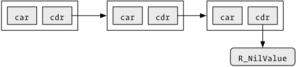
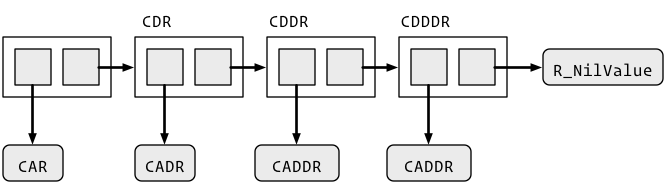

# 10  Pairlists

Pairlists (`LISTSXP`) are linked lists used for calls, unevaluated arguments, [attributes](attributes.llms.md), and `...`. The name comes from Lisp’s “dotted pairs”: each CONS cell is a pair of pointers:

- `CAR` (contents of address register) points to the element.
- `CDR` (contents of decrement register) points to the next cell. The `CDR` of the last cell is `R_NilValue`.

Graphically:



To loop over a pairlist, use this template:

``` c
int pairlist_length(SEXP x) {
  int i = 0;

  for (SEXP cons = x; cons != R_NilValue; cons = CDR(cons)) {
    SEXP el = CAR(cons);
    i++;
  }

  return i;
}
```

## 10.1 Test

### 10.1.1 `Rf_isPairList()`, `Rf_isLanguage()`, `Rf_isList()`

**Header:** `Rinternals.h`

Test whether an object is a pairlist, a call, or a pairlist-or-NULL.

``` c
Rboolean Rf_isPairList(SEXP x); // LISTSXP
Rboolean Rf_isLanguage(SEXP x); // LANGSXP
Rboolean Rf_isList(SEXP x);     // LISTSXP, NILSXP
```

**Returns:** `TRUE` when `x` passes the test — a pairlist for `Rf_isPairList()`, a call for `Rf_isLanguage()`, a pairlist or `NULL` for `Rf_isList()`; otherwise `FALSE`.

### 10.1.2 `Rf_isUserBinop()`

**Header:** `Rinternals.h`

Test whether a call is a user-defined binary operator.

``` c
Rboolean Rf_isUserBinop(SEXP);
```

**Returns:** `TRUE` if `x` is a call to a user-defined binary operator (`%...%`), otherwise `FALSE`.

## 10.2 Creation

The `CDR` of the final cell must be `R_NilValue`; the `Rf_list1()`–`Rf_list5()` helpers add the terminator for you.

### 10.2.1 `Rf_cons()`, `Rf_lcons()`

needs protect throws

**Header:** `Rinternals.h`

Create a new CONS cell linking two objects.

``` c
SEXP Rf_cons(SEXP a, SEXP b);   // function arguments
SEXP Rf_lcons(SEXP a, SEXP b);  // calls
```

**Returns:** A freshly allocated cell with `CAR` set to `a` and `CDR` to `b`: a `LISTSXP` from `Rf_cons()`, a `LANGSXP` from `Rf_lcons()`.

The `CDR` of the final value must be `R_NilValue`.

**See also:** [`Rf_list1()`](#Rf_list1), [`Rf_lang1()`](#Rf_lang1)

### 10.2.2 `Rf_list1()`, `Rf_list2()`, `Rf_list3()`, `Rf_list4()`, `Rf_list5()`, `Rf_list6()`

needs protect throws

**Header:** `Rinternals.h`

Create a pairlist of one to six elements.

``` c
SEXP Rf_list1(SEXP x1);
SEXP Rf_list2(SEXP x1, SEXP x2);
SEXP Rf_list3(SEXP x1, SEXP x2, SEXP x3);
SEXP Rf_list4(SEXP x1, SEXP x2, SEXP x3, SEXP x4);
SEXP Rf_list5(SEXP x1, SEXP x2, SEXP x3, SEXP x4, SEXP x5);
SEXP Rf_list6(SEXP x1, SEXP x2, SEXP x3, SEXP x4, SEXP x5, SEXP x6);
```

**Returns:** A freshly allocated pairlist of one to six elements, terminated by `R_NilValue`.

These automatically add the terminating `R_NilValue`.

**See also:** [`Rf_cons()`](#Rf_cons), [`Rf_lang1()`](#Rf_lang1)

### 10.2.3 `Rf_lang1()`, `Rf_lang2()`, `Rf_lang3()`, `Rf_lang4()`, `Rf_lang5()`, `Rf_lang6()`

needs protect throws

**Header:** `Rinternals.h`

Create a call to a function with zero to five arguments.

``` c
SEXP Rf_lang1(SEXP x1);
SEXP Rf_lang2(SEXP x1, SEXP x2);
SEXP Rf_lang3(SEXP x1, SEXP x2, SEXP x3);
SEXP Rf_lang4(SEXP x1, SEXP x2, SEXP x3, SEXP x4);
SEXP Rf_lang5(SEXP x1, SEXP x2, SEXP x3, SEXP x4, SEXP x5);
SEXP Rf_lang6(SEXP x1, SEXP x2, SEXP x3, SEXP x4, SEXP x5, SEXP x6);
```

**Returns:** A freshly allocated call (`LANGSXP`) to function `x1` with the given arguments, terminated by `R_NilValue`.

These automatically add the terminating `R_NilValue`.

**See also:** [`Rf_cons()`](#Rf_cons), [`Rf_list1()`](#Rf_list1)

### 10.2.4 `Rf_allocFormalsList2()`, `Rf_allocFormalsList3()`, `Rf_allocFormalsList4()`, `Rf_allocFormalsList5()`, `Rf_allocFormalsList6()`

needs protect throws

**Header:** `Rinternals.h`

Allocate a formals pairlist of two to six elements.

``` c
SEXP Rf_allocFormalsList2(SEXP x1, SEXP x2);
SEXP Rf_allocFormalsList3(SEXP x1, SEXP x2, SEXP x3);
SEXP Rf_allocFormalsList4(SEXP x1, SEXP x2, SEXP x3, SEXP x4);
SEXP Rf_allocFormalsList5(SEXP x1, SEXP x2, SEXP x3, SEXP x4, SEXP x5);
SEXP Rf_allocFormalsList6(SEXP x1, SEXP x2, SEXP x3, SEXP x4, SEXP x5, SEXP x6);
```

**Returns:** A freshly allocated formals pairlist of two to six elements, tagged with the given symbols.

These automatically add the terminating `R_NilValue`.

### 10.2.5 `Rf_PairToVectorList()`, `Rf_VectorToPairList()`

experimental needs protect throws

**Header:** `Rinternals.h`

Convert a pairlist to a list vector, or a list vector to a pairlist.

``` c
SEXP Rf_PairToVectorList(SEXP x);
SEXP Rf_VectorToPairList(SEXP x);
```

**Returns:** A freshly allocated copy of `x` converted to a list vector (`Rf_PairToVectorList()`) or a pairlist (`Rf_VectorToPairList()`).

### 10.2.6 `Rf_listAppend()`

experimental

**Header:** `Rinternals.h`

Append one pairlist to another.

``` c
SEXP Rf_listAppend(SEXP source, SEXP target);
```

**Returns:** The mutated `source` pairlist, now with `target` appended; no new cells are allocated.

Mutates `source` in place by walking to its last cell and setting its `CDR` to `target`; no new cells are allocated and the returned pairlist is the (mutated) `source` you already hold.

### 10.2.7 `Rf_allocLang()`

needs protect throws

**Header:** `Rinternals.h`\
**Since:** 4.4.1

Allocate a call (LANGSXP) with room for a function and n - 1 arguments.

``` c
SEXP Rf_allocLang(int n);
```

- `n`: total number of pairlist nodes (function plus arguments).

**Returns:** A freshly allocated call (`LANGSXP`) with `n` nodes, all elements initially `R_NilValue`.

The API replacement for the non-API idiom `Rf_allocList(n)` + `SET_TYPEOF(..., LANGSXP)`. Fill in the function and arguments with `SETCAR()`/`SETCADR()` etc. before evaluating.

**See also:** [`Rf_lang1()`](#Rf_lang1), [`Rf_allocList()`](#Rf_allocList)

### 10.2.8 `CONS()`, `LCONS()`

needs protect throws

**Header:** `Rinternals.h`

Prepend an element to a pairlist or call.

``` c
#define CONS(a, b)  Rf_cons((a), (b))
#define LCONS(a, b) Rf_lcons((a), (b))
```

Macro aliases for `Rf_cons()`/`Rf_lcons()`; the `Rf_` forms are preferred in new code.

**See also:** [`Rf_cons()`](#Rf_cons), [`Rf_lcons()`](#Rf_lcons)

## 10.3 Accessors

Unlike lists (`VECSXP`), pairlists can’t be indexed directly. Instead you navigate with `CAR()` (the first element) and `CDR()` (the rest of the list), composed into `CAAR()`, `CADDR()`, and so on, with matching setters `SETCAR()`, `SETCDR()`, etc.



### 10.3.1 `CAR()`, `CDR()`, `CAAR()`, `CDAR()`, `CADR()`, `CDDR()`, `CDDDR()`, `CADDR()`, `CADDDR()`, `CAD4R()`, `CAD5R()`

**Header:** `Rinternals.h`

Get the first element or a nested component of a CONS cell.

``` c
SEXP CAR(SEXP e);
SEXP CDR(SEXP e);
SEXP CAAR(SEXP e);
SEXP CDAR(SEXP e);
SEXP CADR(SEXP e);
SEXP CDDR(SEXP e);
SEXP CDDDR(SEXP e);
SEXP CADDR(SEXP e);
SEXP CADDDR(SEXP e);
SEXP CAD4R(SEXP e);
SEXP CAD5R(SEXP e);
```

**Returns:** The requested component of cell `e` — a pointer into the existing structure, not a copy.

Pairlists can’t be indexed directly, so these accessors navigate the linked list instead. `CAR()` returns the first element and `CDR()` the rest; they compose to give `CAAR()`, `CDAR()`, `CADDR()`, `CADDDR()`, and so on.

**See also:** [`SETCAR()`](#SETCAR), [`TAG()`](#TAG)

### 10.3.2 `SETCAR()`, `SETCDR()`, `SETCADR()`, `SETCADDR()`, `SETCADDDR()`, `SETCAD4R()`

**Header:** `Rinternals.h`

Set the first element or a nested component of a CONS cell.

``` c
SEXP SETCAR(SEXP x, SEXP y);
SEXP SETCDR(SEXP x, SEXP y);
SEXP SETCADR(SEXP x, SEXP y);
SEXP SETCADDR(SEXP x, SEXP y);
SEXP SETCADDDR(SEXP x, SEXP y);
SEXP SETCAD4R(SEXP e, SEXP y);
```

**Returns:** The assigned value `y`; the cell is modified in place.

Mirror the `CAR()`/`CDR()` family of getters.

**See also:** [`CAR()`](#CAR), [`SET_TAG()`](#SET_TAG)

### 10.3.3 `TAG()`, `SET_TAG()`

**Header:** `Rinternals.h`

Get or set the tag (name) attached to a node of a pairlist.

``` c
SEXP TAG(SEXP e);
void SET_TAG(SEXP x, SEXP y);
```

**Returns:** `TAG()` returns the tag (name) attached to node `e`, or `R_NilValue` if it has none.

**See also:** [`CAR()`](#CAR)

### 10.3.4 `MISSING()`

**Header:** `Rinternals.h`

Test whether a pairlist element is a missing argument.

``` c
int MISSING(SEXP x);
```

**Returns:** Non-zero if `x` is a missing argument, `0` otherwise.

`SET_MISSING()` was removed from the headers in R 4.6.0.

### 10.3.5 Pretending it’s a vector

A few functions let you treat a pairlist like a vector. These make it easy to write \\O(n^2)\\ code, but pairlists are usually short enough that it doesn’t matter.

### 10.3.6 `Rf_allocList()`

needs protect throws

**Header:** `Rinternals.h`

Create a new pairlist of the specified length.

``` c
SEXP Rf_allocList(int n);
```

**Returns:** A freshly allocated pairlist of length `n` with all elements `R_NilValue`.

Treats the pairlist as if it were a vector, which is easy to get O(n^2) from, but is unlikely to be a bottleneck at typical pairlist sizes. To create a call expression, use `Rf_allocLang()` (added in R 4.4.1) or `Rf_lcons()` rather than `Rf_allocList()` plus `SET_TYPEOF()`, which will not be available to packages in the future.

**See also:** [`Rf_nthcdr()`](#Rf_nthcdr), [`Rf_lcons()`](#Rf_lcons)

### 10.3.7 `Rf_nthcdr()`

throws

**Header:** `Rinternals.h`

Access the nth element of a pairlist.

``` c
SEXP Rf_nthcdr(SEXP x, int n);
```

**Returns:** The tail of `x` after `n` `CDR`s — a pointer into the existing pairlist, not a copy.

Treats the pairlist as if it were a vector; repeated calls can become O(n^2), though this is unlikely to matter at typical pairlist sizes. Errors if `x` is not a pairlist or has fewer than `n` elements.

**See also:** [`Rf_allocList()`](#Rf_allocList), [`CDR()`](#CDR)

### 10.3.8 `Rf_elt()`, `Rf_lastElt()`

**Header:** `Rinternals.h`

Get an element of a pairlist by index, or the last element.

``` c
SEXP Rf_elt(SEXP, int);
SEXP Rf_lastElt(SEXP);
```

**Returns:** `Rf_elt()` returns the element of the pairlist at the given index and `Rf_lastElt()` the last element; both are pointers into the existing structure, not copies.

### 10.3.9 Creating a call

Pairlists are most commonly used to build function calls. Calls with 0 to 5 unnamed arguments can be created directly with `Rf_lang1()` to `Rf_lang6()`. For named arguments, build the call and set tags yourself:

``` c
// equivalent of: fun(arg1 = a, arg2 = b, arg3 = c)
SEXP call = PROTECT(Rf_allocVector(LANGSXP, 4)); // 4 = # of args + 1
SETCAR(call, fun);

SEXP s = CDR(call);
SETCAR(s, a);
SET_TAG(s, Rf_install("arg1"));

s = CDR(s);
SETCAR(s, b);
SET_TAG(s, Rf_install("arg2"));

s = CDR(s);
SETCAR(s, c);
SET_TAG(s, Rf_install("arg3"));

SEXP out = PROTECT(Rf_eval(call, env));
...
UNPROTECT(2);
```

## 10.4 Dots (`DOTSXP`)

`DOTSXP` represents the `...` structure inside a function. Retrieve it with `Rf_findVar(R_DotsSymbol, env)` or similar. It’s usually a pairlist, but is `R_MissingArg` when there are no `...` arguments.

## 10.5 Null (`NILSXP`)

There is a single value of type `NILSXP`: `R_NilValue`. It corresponds to `NULL` in R and is often used as a generic zero-length vector — and as the terminator of every pairlist.
