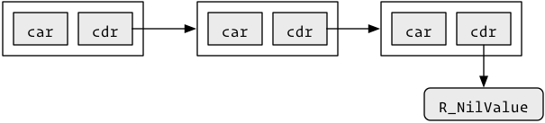
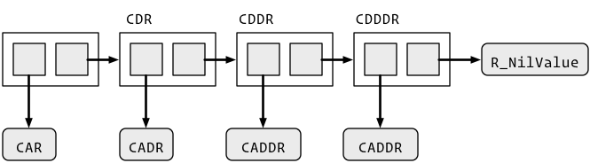

# Pairlists (`LISTSXP`, `DOTSXP` & `LANGSXP`)

Pairlists are linked lists used for calls, unevaluated arguments, attributes, and in `...`. 

```cpp
Rboolean Rf_isPairList(SEXP); // LISTSXP
Rboolean Rf_isLanguage(SEXP); // LANGSXP
Rboolean Rf_isList(SEXP);     // LISTSXP, NILSXP
```

The terminology of pairlist comes from LISPs "dotted pairs" which is a way of describing "CONS" cells. A CONS cell is a pair of pointers:

* "CAR" (contents of address register) points to an object
* "CDR" (contents of decrement register) points to the next element in the list.
  The CDR of the last element is `R_NilValue`. 

Graphically, this looks like:



To loop over all elements of a pairlist, use this template:

```cpp
int length(SEXP s) {
  int i = 0;
  
  for(SEXP cons = x; cons != R_NilValue; cons = CDR(nxt) {
    SEXP el = CAR(cons);
    i++;
  }
  
  return i;
}
```
## Creation

```cpp
SEXP Rf_cons(SEXP a, SEXP b)   // function arguments
SEXP Rf_lcons(SEXP a, SEXP b)  // calls
```

The `CDR` of the final value msut be `R_NilValue`. 

There are helpers for 5-6 arguments. These automatically add the terminating `R_NilValue`.

```cpp
SEXP Rf_list1(SEXP x1);
SEXP Rf_list2(SEXP x1, SEXP x2);
SEXP Rf_list3(SEXP x1, SEXP x2, SEXP x3);
SEXP Rf_list4(SEXP x1, SEXP x2, SEXP x3, SEXP x4);
SEXP Rf_list5(SEXP x1, SEXP x2, SEXP x3, SEXP x4, SEXP x5);

SEXP Rf_lang1(SEXP x1);
SEXP Rf_lang2(SEXP x1, SEXP x2);
SEXP Rf_lang3(SEXP x1, SEXP x2, SEXP x3);
SEXP Rf_lang4(SEXP x1, SEXP x2, SEXP x3, SEXP x4);
SEXP Rf_lang5(SEXP x1, SEXP x2, SEXP x3, SEXP x4, SEXP x5);
SEXP Rf_lang6(SEXP x1, SEXP x2, SEXP x3, SEXP x4, SEXP x5, SEXP x6);

SEXP Rf_allocFormalsList2(SEXP x1, SEXP x2);
SEXP Rf_allocFormalsList3(SEXP x1, SEXP x2, SEXP x3);
SEXP Rf_allocFormalsList4(SEXP x1, SEXP x2, SEXP x3, SEXP x4);
SEXP Rf_allocFormalsList5(SEXP x1, SEXP x2, SEXP x3, SEXP x4, SEXP x5);
SEXP Rf_allocFormalsList6(SEXP x1, SEXP x2, SEXP x3, SEXP x4, SEXP x5, SEXP x6);
```

```cpp
SEXP Rf_PairToVectorList(SEXP x);
SEXP Rf_VectorToPairList(SEXP x);
SEXP Rf_listAppend(SEXP source, SEXP target);
```

## Accessors

Unlike lists (`VECSXP`s), pairlists (`LISTSXP`s) have no way to index into an arbitrary location. Instead, R provides a set of helper functions that navigate along a linked list. The basic helpers are `CAR()`, which extracts the first element of the list, and `CDR()`, which extracts the rest of the list. These can be composed to get `CAAR()`, `CDAR()`, `CADDR()`, `CADDDR()`, and so on. Corresponding to the getters, R provides setters `SETCAR()`, `SETCDR()`, etc.



```cpp
SEXP CAR(SEXP e);
SEXP CDR(SEXP e);
SEXP CAAR(SEXP e);
SEXP CDAR(SEXP e);
SEXP CADR(SEXP e);
SEXP CDDR(SEXP e);
SEXP CDDDR(SEXP e);
SEXP CADDR(SEXP e);
SEXP CADDDR(SEXP e);
SEXP CAD4R(SEXP e);
SEXP SETCAR(SEXP x, SEXP y);
SEXP SETCDR(SEXP x, SEXP y);
SEXP SETCADR(SEXP x, SEXP y);
SEXP SETCADDR(SEXP x, SEXP y);
SEXP SETCADDDR(SEXP x, SEXP y);
SEXP SETCAD4R(SEXP e, SEXP y);

void SET_TAG(SEXP x, SEXP y);
SEXP (TAG)(SEXP e);

// CONS with no-refcounting ?
SEXP CONS_NR(SEXP a, SEXP b);


// Used for missing values in function calls?
int  (MISSING)(SEXP x);
void (SET_MISSING)(SEXP x, int v);
```

### Pretending it's a vector

Some functions allow you to work with a pair list as if it's a vector:

```cpp
SEXP Rf_allocList(int n);   # create new pairlist of specified length 
SEXP Rf_nthcdr(SEXP, int);  # access nth element
```

If you use these it's easy to get O(n^2) behaviour, but for the usual size of pairlists, this is unlikely to cause a performance bottleneck.

## Dots (`DOTSXP`)

Represents the `...` structure in R. Easiest to get to with `findVar(R_DotsSymbol, env)` or similar. Is usually a pair list, but will have value `R_MissingArg` if there are no arguments.

## Null (`NILSXP`)

There is a single value with type `NILSXP`: `R_NilValue`.  This corresponds to `NULL` in R, and is often used as generic zero length vector.

## Attributes

```cpp
SEXP Rf_getAttrib(SEXP x, SEXP symbol);
SEXP Rf_setAttrib(SEXP x, SEXP symbol, SEXP value);

// Copies attributes except names, dim, and dimnames
void Rf_copyMostAttrib(SEXP source, SEXP target);
```
